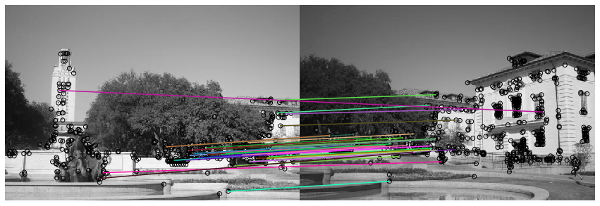
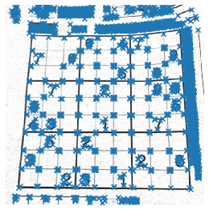
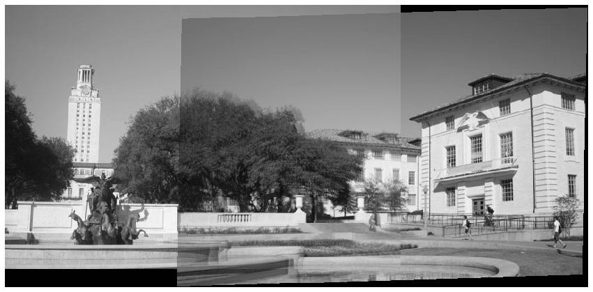

# Task1

本作业涵盖了全景拼接的方法，如描述符匹配、转换估计和RANSAC。

[源代码库](https://github.com/YangboLong/image-stitcher)
## 简介:全景拼接

全景拼接是计算机视觉领域的早期成就。Matthew Brown和David G. Lowe在2007年发表了一篇著名的[全景图像拼接论文](http://matthewalunbrown.com/papers/ijcv2007.pdf)后，自动全景拼接技术被广泛应用于谷歌街景、智能手机全景照片、以及诸如Photosynth和AutoStitch等拼接软件。

在这个作业中，我们将从多个图像中检测和匹配关键点，以构建一个单一的全景图像。这将涉及到几个任务:

1. 比较两组来自不同图像的描述符，并找到匹配的关键点。
2. 给定一个匹配的关键点列表，使用最小二乘方法来找到将一个图像中的点映射到另一个图像中的仿射变换矩阵。
3. 使用RANSAC对仿射变换矩阵给出一个更可靠的估计。给定变换矩阵，用它来变换第二张图像，并将其覆盖在第一张图像上，形成全景图。
4. 将全景图像混合在一起，以消除重叠图像的模糊区域。
5. 将多个全景图像缝合在一起。

有很多材料可以亲自动手，所以我们建议早点开始!

## Part 1 关键点匹配

你将得到在两个图像中的关键点(通过运行Harris角检测器获得)。我们想要你回答的问题是:我们怎么判断某两个点是两张图的同一个点?为了“匹配”检测到的关键点，我们必须想出一种方法来根据它们的局部外观来“描述”关键点。通常，检测到的关键点位置周围的每个区域都被转换为一个固定大小的向量，称为“描述子”。

我们已经为您实现了一个简单的描述子函数。

```
#include<opencv2\opencv.hpp>
#include<opencv2\imgproc\imgproc.hpp>
#include<opencv2\highgui\highgui.hpp>

 
// Namespace nullifies the use of cv::function(); 
using namespace std;
using namespace cv;

int main(){

    Mat img1 = imread('uttower1.jpg', 0);
    Mat img2 = imread('uttower2.jpg', 0)


    waiKey(0);
    return 0;
}

std::vector<Point> harris_corners(Mat img)
{
    int blockSize = 2;
    int apertureSize = 3;
    double k = 0.04;
    
    Mat dst = cv::Mat::zeros( img.size(), CV_32FC1 );
    cornerHarris( img, dst, blockSize, apertureSize, k );

    Mat dst_norm, dst_norm_scaled;

    normalize( dst, dst_norm, 0, 255, cv::NORM_MINMAX, CV_32FC1, cv::Mat() );
    convertScaleAbs( dst_norm, dst_norm_scaled );

    /// Drawing a circle around corners
    for (int j = 0; j < dst_norm.rows; j++)
    {
        for (int i = 0; i < dst_norm.cols; i++)
        {
            if ((int)dst_norm.at<float>(j, i) > 165)
            {

                circle(dst_norm_scaled, Point(i, j), 5, Scalar(0), 2, 8, 0);
            }
        }
    }
    /// Showing the result
    namedWindow("corners_window", CV_WINDOW_AUTOSIZE);
    imshow("corners_window", dst_norm_scaled);

    std::vector<Point> keypoints;
    for (int j = 0; j < dst_norm.rows; j++)
    {
        for (int i = 0; i < dst_norm.cols; i++)
        {
            if ((int)dst_norm.at<float>(j, i) > 165)
            {

               Point kp(i, j);
               keypoints.pushback(kp);
            }
        }
    }


    return keypoints;
}

```

### Part 1.1 匹配关键点 

在两组描述子中查找正确的匹配。首先，计算图像1和图像2中所有描述子对之间的欧氏距离。然后使用它来确定是否有良好的匹配:对于图像1中的每个描述子，如果与图像2中最近的描述子的距离显著(按给定的因子)小于与第二最近的描述子的距离，我们称之为匹配。该函数的输出是一个数组，其中每行保存一对匹配描述符的下标。




## Part 2 计算变换量

现在我们有了两个图像中匹配的关键点列表。我们将使用它来找到一个变换矩阵，将第二张图像中的点映射到第一张图像中的对应坐标。换句话说，如果图像1中的点 $p_1 =[y_1,x_1]$ 与图像2中的点 $p_2=[y_2, x_2]$ 相匹配，我们需要找到一个仿射变换矩阵 $H$ ，使

$$
\tilde{p_2}H = \tilde{p_1},
$$

 $\tilde{p_1}$ 和 $\tilde{p_2}$ 是 $p_1$ 和 $p_2$ 的齐次坐标.

请注意，可能不可能找到将图像2中的每个点精确映射到图像1中的对应点的变换$H$。然而，我们可以用最小二乘估计变换矩阵。给定$N$匹配的关键点对，设$X_1$和$X_2$为$N \ * 3$矩阵，其行分别为图像1和图像2中对应关键点的齐次坐标。然后，我们可以通过解最小二乘问题来估计$H$，

$$
X_2 H = X_1
$$



## Part 3 RANSAC

我们可以使用RANSAC(“RANdom SAmple Consensus”)选择匹配点来计算转换矩阵。

RANSAC的步骤如下:
1. 选择随机匹配集
2. 计算仿射变换矩阵
3.使用给定的阈值查找内嵌
4. 重复并保留最大的内线集(使用>，即根据最先看到的集合打破联系)
5. 重新计算所有内线上的最小二乘估计

在这种情况下，使用匹配点之间的欧几里得距离作为内值与异常值的度量。

## Part 4: 更好的缝合

你会注意到在最终的全景图像中间模糊的区域和令人不愉快的线条。使用一种叫做线性混合的非常简单的技术，我们可以从全景图中平滑出很多这些伪影。

目前，重叠区域的所有像素都是同等加权的。然而，由于重叠的左右两端的像素与其他图像中的像素很好地互补，因此可以使它们对最终全景图的贡献较小。

线性混合可以通过以下步骤完成:
1. 定义用于混合的左右边距
2. 为图像1定义一个权重矩阵，这样:
—从输出空间左侧到左侧空白处的权重值为1
—从左距到右距，权重值从1到0线性递减
3.为图像2定义一个权重矩阵，这样:
—从输出空间右侧到右侧空白处的权重值为1
—从左距到右距，权重值从0到1线性递增
4. 将权重矩阵应用到相应的图像上
5. 合并图像



